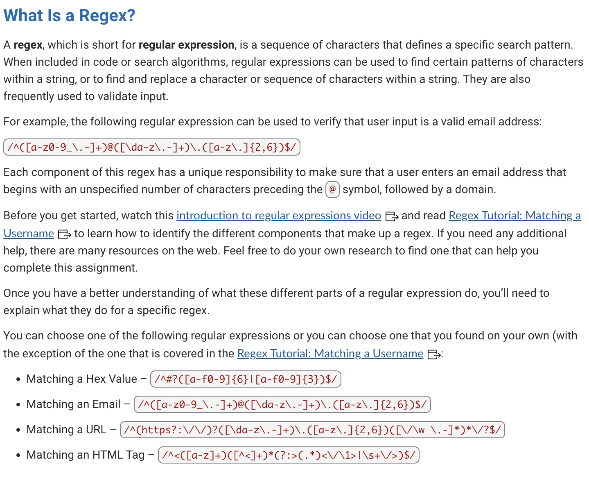

# Regex Tutorial

## User Story

 

AS A web development student
I WANT a tutorial explaining a specific regex
SO THAT I can understand the search pattern the regex defines

# Acceptance Criteria

GIVEN a regex tutorial
 

<ul>
<li>WHEN I open the tutorial</li>
<li>THEN I see a descriptive title and introductory paragraph explaining the purpose of the tutorial,</li>
<li>WHEN I click on the links in the table of contents</li>
<li>THEN I am taken to the corresponding sections of the tutorial</li>
<li>WHEN I read through each section of the tutorial</li>
<li>THEN I find a detailed explanation of what a specific component of the regex does</li>
<li>WHEN I reach the end of the tutorial</li>
<li>THEN I find a section about the author and a link to the author's GitHub profile</li>
</ul>

[Deployed Site](placeholder)

Contribution guidelines for this project

